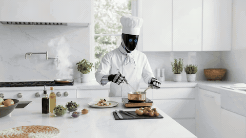

# Maximus



This two-day project showcases Maximus, a humanoid robot concept developed for the AI Prompt Design course within the Master in Design and Innovation. Throughout the course, I explored AI-driven media generation workflows using tools such as Kling AI, Google Veo, Runway, Vizcom, FLUX, and Wan.

Instructor: Alejandro Gandarilla, M.S. in Synthetic Landscapes from the Southern California Institute of Architecture (SCI-Arc) and Head of Technology at the Center for Technological Revolution in Creative Industries.
## Structure

```
index.html      Single-page site (intro, home, deployment sections)
css/style.css   Styles
js/script.js    Section navigation, menu, scroll behavior
media/          Logo, favicon, and generated video scenes
```
